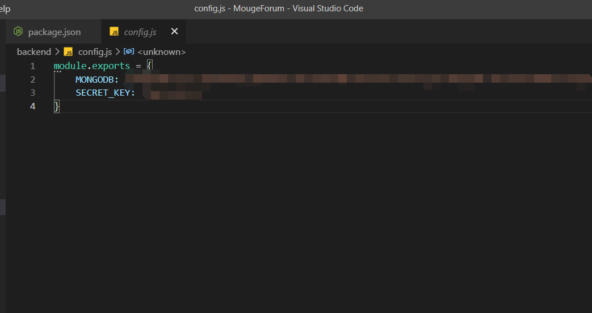

# Mouge Forum  

https://mougeforum.netlify.app/

## Prerequisite
- Node.js

## Description
A light weight forum for people to share their thoughts and interact with others.

## Usage
- In the client folder, run `npm install`
- In the backend folder, run `npm install`
- In the backend folder, create a `config.js` file:   enter your mongodb url and a secret key used to encode passwords.
- To run the backend server, `node index` in the backend folder; To run the client, `npm start` in the client folder.  
  
